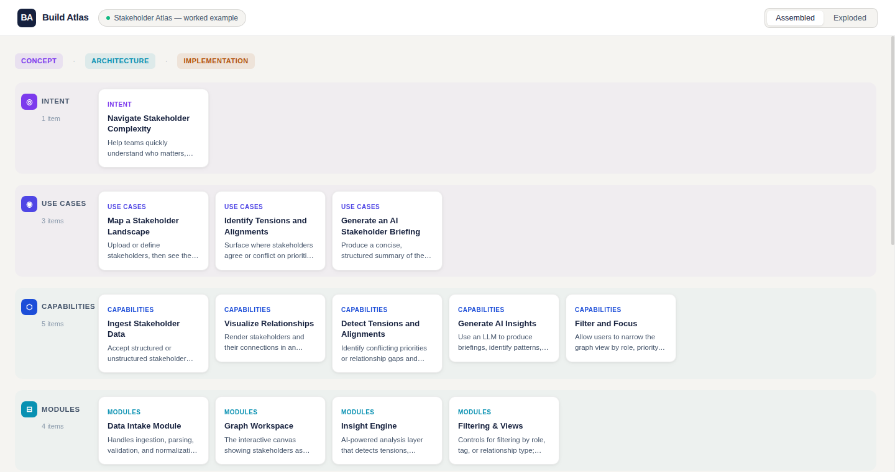
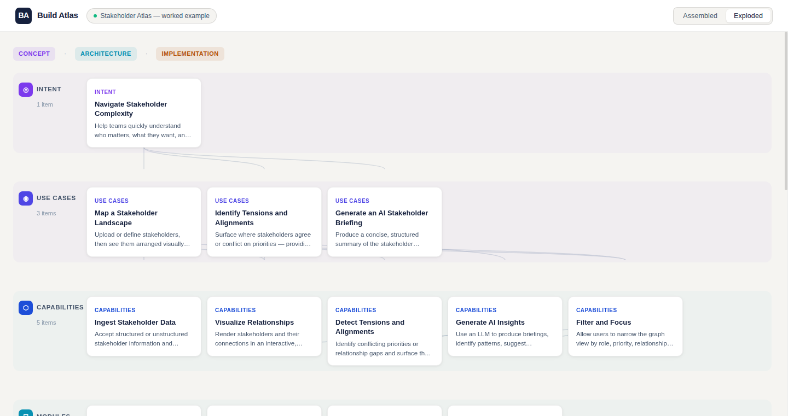
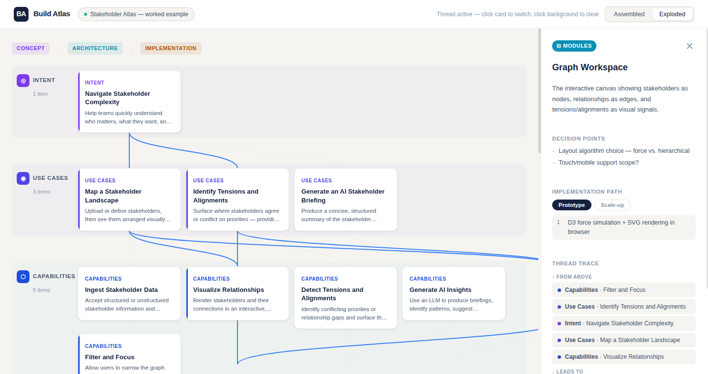

# Build Atlas — Architecture as Journey

> *Separation without loss of context.*

A guided visual construction interface that helps a person move from **intent** → **concept** → **modules** → **layers** → **implementation paths** → **concrete code** without losing orientation.

## What it is

Build Atlas is a single-page interactive prototype that demonstrates an **exploded-view architecture journey** — a UX metaphor borrowed from engineering exploded drawings, applied to software system design.

Rather than showing a finished static architecture diagram, Build Atlas shows **how a system takes shape** through progressive layers of detail, supporting both:

- **Journey mode** — follow one narrative thread from intent all the way to code artifacts
- **Exploded view mode** — spatially separate layers for structural inspection while preserving relationships

## Live demo

Open `index.html` in any modern browser (or serve the directory with any HTTP server).

## Worked example

The prototype uses an **AI-powered Stakeholder Mapping Tool** as its worked example — walking through all 8 stages:

| Stage | Count | Description |
|---|---|---|
| Intent | 1 | Why the system exists |
| Use Cases | 3 | What concrete workflows it serves |
| Capabilities | 5 | What the system must do |
| Modules | 4 | Functional building blocks |
| Layers | 4 | Structural organization (UI / Logic / Data / AI) |
| Patterns | 3 | Implementation approaches |
| Components | 5 | Concrete parts (canvas, schemas, APIs...) |
| Code | 4 | Starter implementation artifacts |

## Key interactions

- **Assembled / Exploded toggle** — Switch between compact overview and spatially separated layers
- **Click any card** — Highlights its full thread across all stages and opens a detail panel
- **Thread trace** — Navigate up/down the thread directly from the detail panel
- **Detail panel** — Shows decision points, prototype vs scale-up paths, and code artifact previews

## Screenshots

### Assembled mode (initial view)


### Exploded mode (layers separated)


### Thread active — Graph Workspace module selected


## File structure

```
index.html      — Single-page application shell
style.css       — Design system (CSS variables, layout, components)
data.js         — JSON-driven content model for the worked example
app.js          — Application logic (rendering, selection, connectors)
```

## Tech stack

- Vanilla HTML / CSS / JavaScript — no framework required
- SVG overlay for relationship connector lines
- CSS Grid / Flexbox for structural layout
- JSON-driven content model (easily swappable for any system)

## Design principles

- Overview first, depth on demand
- Progressive disclosure across 8 abstraction layers
- Calm, engineered visual language with breathing room
- Connector lines preserve relationships during explosion
- Thread highlighting shows lineage without losing context
